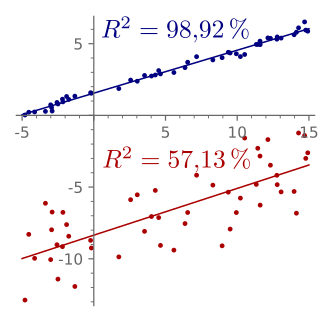

8. What is the difference between MSE and R2?
 
-> The difference between both is
    1) MSE gives the mean of the squared error it is a risk function whereas the r2 gives the proportion of dependant variable's total variance explained by the model's predictions using r2 we can get to know whether the model is able to predict variance or is it just predicting the mean of dependant.
     
    
     
    fig.r2 score

    2)The more the value of MSE the bad the model and the more the value of r2 the good the model.The value of r2 stays in 0 to 1.
    
